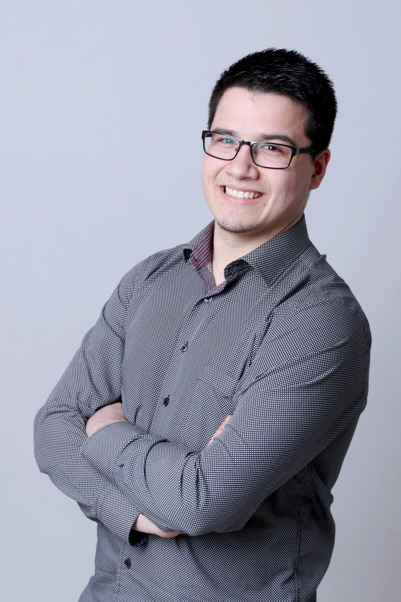
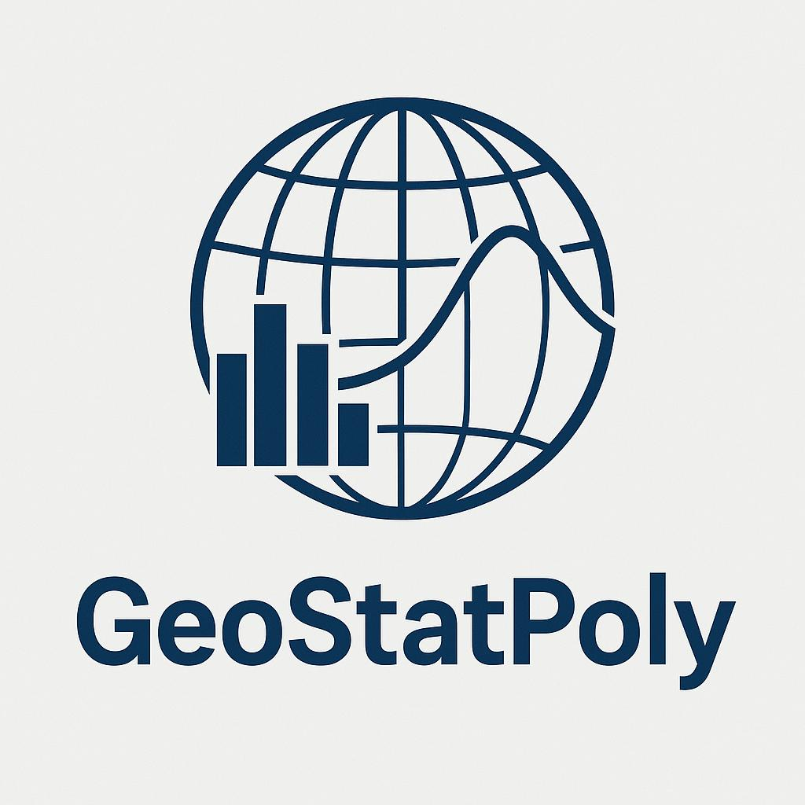

:::::: {.hero-banner style="--hero-field: url('assets/field-blue.png');"}
::::: {.hero-grid}
:::: {.hero-intro}
# Dany Lauzon

### Assistant Professor in Geostatistics

**Polytechnique Montréal** · Department of Civil, Geological and Mining Engineering

Stochastic modeling of the subsurface using geostatistical methods and machine learning, and solving inverse problems in hydrogeology.

::: {.hero-links}
[ Email](mailto:dany.lauzon@polymtl.ca)
[ GitHub](https://github.com/Danlauz)
[ LinkedIn](https://ca.linkedin.com/in/dany-lauzon-ph-d-ba9128115)
[ Scholar](https://scholar.google.com/citations?user=1ltoBQIAAAAJ&hl=en)
[ ORCID](https://orcid.org/0000-0001-7774-4460)
:::
::::

:::: {.hero-portrait}

📷 Add your photo: <code>assets/portrait.jpg</code>

::::
:::::
::::::

## About

My research interests encompass stochastic modeling of the subsurface using geostatistical methods and machine learning, as well as solving inverse problems in hydrogeology. I am currently focused on developing new geostatistical algorithms to produce accurate underground geological models, with applications in hydrogeology and geotechnics. I am also working on surrogate modeling by combining deep learning and geostatistical algorithms for groundwater flow. My work aims to reduce uncertainties related to subsurface modeling, in order to help engineers and specialists make decisions that effectively mitigate economic, environmental, and social risks.

### Research Areas

::: {.research-interests}
[Geostatistics]{.interest-badge}[Hydrogeological modeling]{.interest-badge}[Stochastic simulation]{.interest-badge}[Inverse problems]{.interest-badge}[Surrogate modeling]{.interest-badge}[Deep learning]{.interest-badge}
:::

## Recent Research

::: {.card}
::: {.card-header}
### Recent Publications (2025)
:::
::: {.card-body}
**Lauzon, D.**, Straubhaar, J., & Renard, P. (2025). A Deep Generative Model for the Simulation of Discrete Karst Networks. *Earth and Space Science*, 12(10).

**Lauzon, D.**, & Hörning, S. (2025). Efficient computation on large regular grids of higher-order spatial statistics via fast fourier transform. *Computers & Geosciences*, 105878 (38 pages).

Liang, X. X., Gloaguen, E., Claprood, M., Paradis, D., & **Lauzon, D.** (2025). Graph Neural Network Framework for Spatiotemporal Groundwater Level Forecasting. *Mathematical Geosciences*, 23 pages.

[View all publications →](publications/publications_en.qmd)
:::
:::

## Teaching

::: {.card .hover-lift}
::: {.card-header}
### GLQ3401 — Geostatistics and Mining Geology / GLQ3651 — Mining Geology
:::
::: {.card-body}
Mining laws. Mining sampling. Diamond drilling: deviations, surveying, and mapping. P. Gy's sampling theory. Concepts of resources, reserves, and cut-off grades: Taylor and Lane methods. Resource estimation using geostatistics. Support effect and information effect. Experimental variograms and models. Block, dispersion, and estimation variances. Kriging: simple, ordinary, and indicator. Cokriging. Geostatistical simulation methods. Recoverable resources and other non-linear problems.

[Details GLQ3401 →](https://www.polymtl.ca/programmes/cours/geostatistique-et-geologie-minieres) ·
[Details GLQ3651 →](https://www.polymtl.ca/programmes/cours/geologie-miniere) ·
[Course notes →](en/courses/geostatistics.qmd)
:::
:::

::: {.card .hover-lift}
::: {.card-header}
### GML6402A — Geostatistics
:::
::: {.card-body}
Linear geostatistics, stationary and non-stationary, univariate and multivariate. Block, dispersion, and estimation variances. Simple kriging, ordinary kriging, kriging with drift, kriging with external drift; dual formulation. Cokriging. Variograms, cross-variograms, covariance functions, cross-covariances; models and admissibility conditions. Indicator and multigaussian kriging and cokriging. Unconditional and conditional simulations: turning bands, sequential, matrix, and spectral methods; post-conditioning. Cosimulations. Plurigaussian and multipoint simulations. Simulated annealing, gradual deformations. Applications in hydrogeology, environment, geophysics, resource estimation, and mining operations.

[Details GML6402A →](https://www.polymtl.ca/programmes/cours/geostatistique)
:::
:::

## Software and Codes

I develop and maintain several open-source libraries for geostatistics:

::: {.code-card}
### G-FFTMA
Multivariate geostatistical simulation algorithm on regular grids using the spectral method, based on the Fast Fourier Transform (FFT). Optimized code from the original version by [Liang et al. (2016)](https://doi.org/10.1016/j.cageo.2016.01.005).

[ View on GitHub](https://github.com/Danlauz/NGRF-using-GFFTMA)
:::

::: {.code-card}
### NG-FFTMA
Extension of G-FFTMA for simulating non-Gaussian random fields with spatial asymmetry.

[ View on GitHub](https://github.com/Danlauz/NGRF-using-GFFTMA)
:::

::: {.code-card}
### SpatialStatisticsFFT
Library for efficient computation of higher-order spatial statistics on large regular grids using the FFT.

**Available spatial statistics:** variograms and cross-variograms; covariograms and cross-covariograms; pseudo-cross-variograms; centered and non-centered covariances *(bivariate probabilities, categorical data)*; ergodic and non-ergodic transiograms *(categorical data)*; directional and rank asymmetry; rank correlation; third-order cumulant of a zero-mean random function.

[ View on GitHub](https://github.com/Danlauz/SpatialStatisticsFFT)
:::

## Contact

::: {.contact-grid}
::: {.contact-block}
::: {.label}
Office
:::
Polytechnique Montréal — Room B-648
:::

::: {.contact-block}
::: {.label}
Phone
:::
(514) 340-4711, ext. 3426
:::

::: {.contact-block}
::: {.label}
Email
:::
[dany.lauzon@polymtl.ca](mailto:dany.lauzon@polymtl.ca)
:::

::: {.contact-block}
::: {.label}
Profiles
:::
[GitHub](https://github.com/Danlauz) · [LinkedIn](https://ca.linkedin.com/in/dany-lauzon-ph-d-ba9128115) · [Scholar](https://scholar.google.com/citations?user=1ltoBQIAAAAJ&hl=en)
:::
:::
